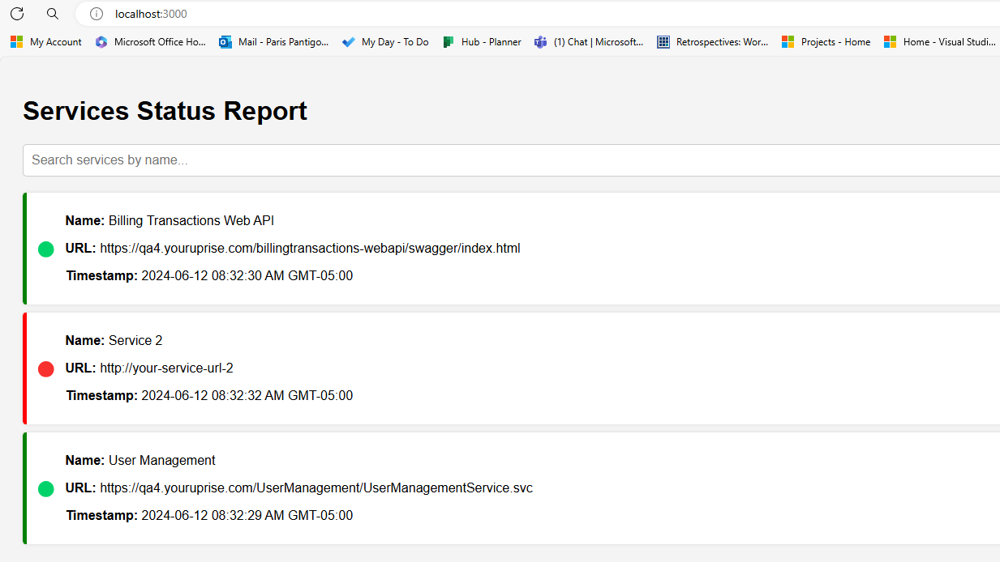
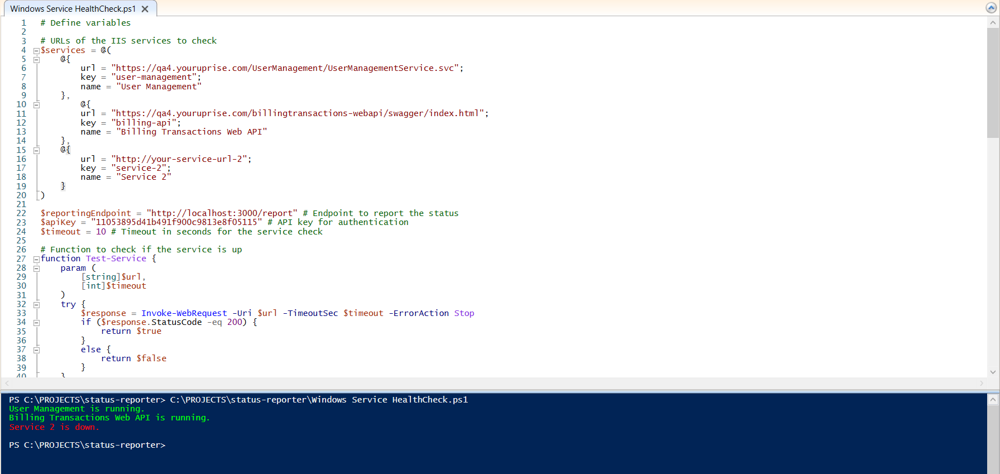

### Running the Server locally

Start the server by running the following command in the terminal:

```bash
node server.js
```

Your server will be running on http://localhost:3000.



### Enable the script

Run the following command to enable your script to run in the IIS Server:

```ps
Set-ExecutionPolicy -ExecutionPolicy RemoteSigned -Scope CurrentUser
```

https://learn.microsoft.com/en-us/powershell/module/microsoft.powershell.core/about/about_execution_policies?view=powershell-7.4

### Running the script

Open Windows PowerShell ISE and execute the script `Windows Service HealthCheck.ps1`.



### Scheduling the Script

You can schedule this script to run at regular intervals using Task Scheduler:

- Open Task Scheduler and create a new task.
- Set the trigger to run the script at your desired interval.
- In the action, specify powershell.exe and the path to your script.

This script will regularly check the status of your IIS services and report it to the endpoint, providing a simple monitoring solution.

### File structure

```java
status-reporter/
├── node_modules/
├── public/
│   └── index.html
│   └── node-server.png
│   └── running-script.png
├── .gitignore
├── reports.json
├── package.json
├── package-lock.json
├── web.config
└── server.js
├── readme.md
└── Windows Service HealthCheck.ps1
```

### Running the server in IIS

1. Install IIS and IISNode

- Open the Server Manager on your Windows Server.
- Click on Manage -> Add Roles and Features.
- Proceed through the wizard until you reach the Server Roles section.
- Check Web Server (IIS) and continue through the wizard to install.
- Download the IISNode module from the IISNode website.
- Run the installer and follow the instructions to install IISNode.

2. Configure IIS to Host Node.js Application

- Open IIS Manager.
- Right-click on Sites in the Connections pane and select Add Website.
- Configure the site:
- Site name: YourSiteName
- Physical path: Point this to the directory where your Node.js application (including server.js) is located.
- Port: Assign a port number, e.g., 8080.
- Click OK to create the site.

3. Install Node.js

- Download the Windows installer from the Node.js official website.
- Run the installer and follow the setup instructions.

4. Run Your Application

- Make sure all your application files, including server.js, package.json, and web.config, are in the directory specified in the IIS site configuration.
- Open IIS Manager.
- Ensure the IIS user has the necessary permissions to access the Node.js application directory and execute the application.
- Click on your newly created site.
- Click on \*Browse :8080 (http) in the Actions pane (or the appropriate port number you configured).
- Open a browser and navigate to http://localhost:8080 (or the appropriate port number).
- Your Node.js application should now be running and accessible via IIS.
